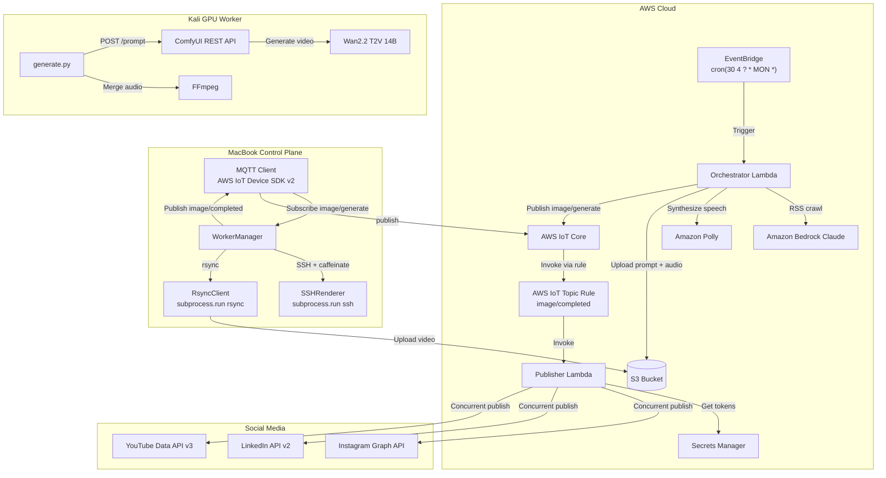
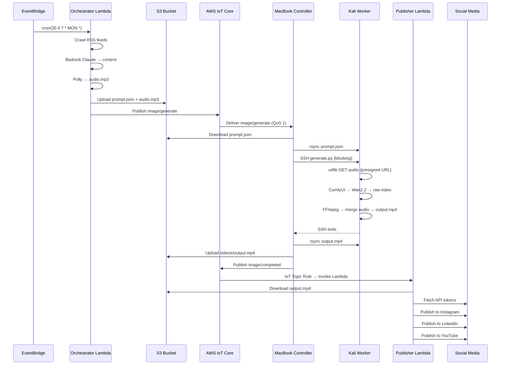

# AI Auto-Publish Image In-House Server — Architecture

## System Overview



## Data Flow

### 1. Orchestration (AWS Lambda)

```
EventBridge fires Monday 04:30 UTC
  → Orchestrator Lambda cold start
  → feedparser crawls configured RSS URLs
  → Bedrock Claude generates:
      - title
      - voiceover_text (narration script)
      - video_prompt (for ComfyUI)
      - instagram_caption, linkedin_caption, youtube_description
      - hashtags
  → Amazon Polly synthesizes voiceover → audio/{jobId}.mp3
  → Upload prompt.json → S3 prompts/{jobId}.json
      (includes presigned URL for audio file)
  → Publish MQTT image/generate { jobId, bucket, promptKey }
```

### 2. Control Plane (MacBook)

```
MQTT subscription: image/generate (AWS IoT Device SDK v2, QoS 1)
  → Download prompt.json from S3
  → Rsync prompt.json to Kali:/tmp/{jobId}.json
  → SSH (with caffeinate to prevent sleep):
      python /home/worker/generate.py \
        --prompt-file /tmp/{jobId}.json \
        --output /tmp/{jobId}.mp4
  → BLOCK until SSH exits (no polling, no heartbeat)
  → Rsync /tmp/{jobId}.mp4 from Kali → local ./artifacts/
  → Upload ./artifacts/{jobId}.mp4 → S3 videos/{jobId}.mp4
  → Publish MQTT image/completed { jobId, bucket, videoKey }
```

If busy when a new job arrives: log "Reject — busy" and drop the message.

### 3. GPU Rendering (Kali — no AWS SDK)

```
generate.py invoked via SSH
  → Read /tmp/{jobId}.json
  → HTTP GET voiceover_url → /tmp/{jobId}.mp3 (urllib, NO boto3)
  → Load wan22.json → inject video_prompt, seed, dimensions
  → POST /prompt → ComfyUI → receive prompt_id
  → Poll GET /history/{prompt_id} every 5s until complete
  → Download raw video via GET /view
  → FFmpeg: merge /tmp/{jobId}.mp3 into raw video
  → Write /tmp/{jobId}.mp4
  → Exit 0 on success, non-zero on failure
```

### 4. Social Publishing (AWS Lambda)

```
MQTT message on image/completed
  → AWS IoT Topic Rule: SELECT * FROM 'image/completed'
  → Invokes Publisher Lambda with { jobId, bucket, videoKey }
  → Download video from S3 to /tmp
  → Generate presigned URL for Instagram
  → Fetch social API tokens from Secrets Manager
  → Concurrent publish (ThreadPoolExecutor max_workers=3):
      - Instagram: direct S3 URL upload (simplest API)
      - LinkedIn: chunked multipart upload (4MB chunks)
      - YouTube: resumable upload (Google protocol)
  → Independent retry per platform (2 attempts + exponential backoff)
  → On 429 (rate limit): skip and log
  → Return ExecutionSummary { jobId, results[] }
```

## Sequence Diagram



## Design Decisions

### Native SSH + rsync over Paramiko

- **Simpler implementation** — no dependency, no library bugs
- **Uses native OS tools** — ssh and rsync are battle-tested
- **Tailscale SSH compatible** — Tailscale provides identity-based auth
- **Easier debugging** — standard SSH flags, verbose mode, known config files
- **Lower maintenance** — no Python library version conflicts
- **Better production reliability** — the SSH process is isolated

### AWS IoT Topic Rule over Lambda MQTT Subscription

- **Correct AWS architecture** — Lambda subscribes to event sources, not MQTT directly
- **Fully managed** — IoT Core handles subscription, reconnection, retry
- **Scalable** — no connection limits per Lambda
- **Observable** — CloudWatch metrics for rule invocations

### Kali Worker Isolation

- Zero AWS SDK dependencies — uses only stdlib `urllib` for HTTP
- Runtime guard at module startup scanning `sys.modules` for forbidden imports
- FFmpeg invoked via `subprocess` — no Python wrapper library

## Security

- **S3 Block Public Access** — all buckets private
- **Presigned URLs** — time-limited (6h for audio, 24h for video)
- **Secrets Manager** — social API tokens encrypted at rest
- **IAM least privilege** — Lambda roles scoped to minimum required actions
- **IoT Topic Rule** — only authorized by IAM and Lambda resource policy
- **Tailscale SSH** — identity-based authentication, no SSH keys

## Failure Modes

| Failure | Behavior |
|---------|----------|
| RSS feed unreachable | Log warning, generate content without current topics |
| Bedrock throttled | Tenacity retry (3 attempts, exponential backoff) |
| Polly exceeds limit | Skip audio, continue without voiceover |
| S3 upload/download fails | Retry 3x, then fail the job |
| SSH connection drops | Tenacity retry for transient errors only |
| generate.py non-zero exit | Do NOT retry — worker error. Log and fail. |
| rsync transfer fails | Retry 3x with exponential backoff |
| Social API 429 (rate limit) | Skip and continue to next platform |
| MQTT disconnect | AWS IoT SDK v2 auto-reconnect with exponential backoff |

## Deployment

See [terraform/README.md](infrastructure/terraform/README.md) for deployment instructions.

## Environment Variables

Key environment variables (see `.env.example` for full list):

| Variable | Description |
|----------|-------------|
| `AWS_REGION` | AWS region (default: us-east-1) |
| `CONTENT_BUCKET` | S3 bucket for content storage |
| `IOT_ENDPOINT` | AWS IoT Core ATS endpoint |
| `RSS_FEED_URLS` | Comma-separated RSS feed URLs |
| `WORKER_SSH_HOST` | Tailscale hostname of Kali worker |
| `SSH_TIMEOUT_SECONDS` | Max SSH execution time (default: 3600) |
| `INSTAGRAM_SECRET_ID` | Secrets Manager secret name |
| `LINKEDIN_SECRET_ID` | Secrets Manager secret name |
| `YOUTUBE_SECRET_ID` | Secrets Manager secret name |
